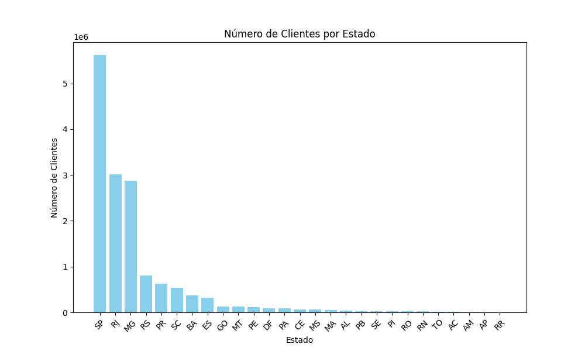
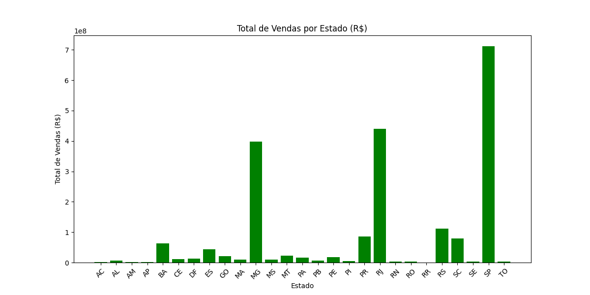
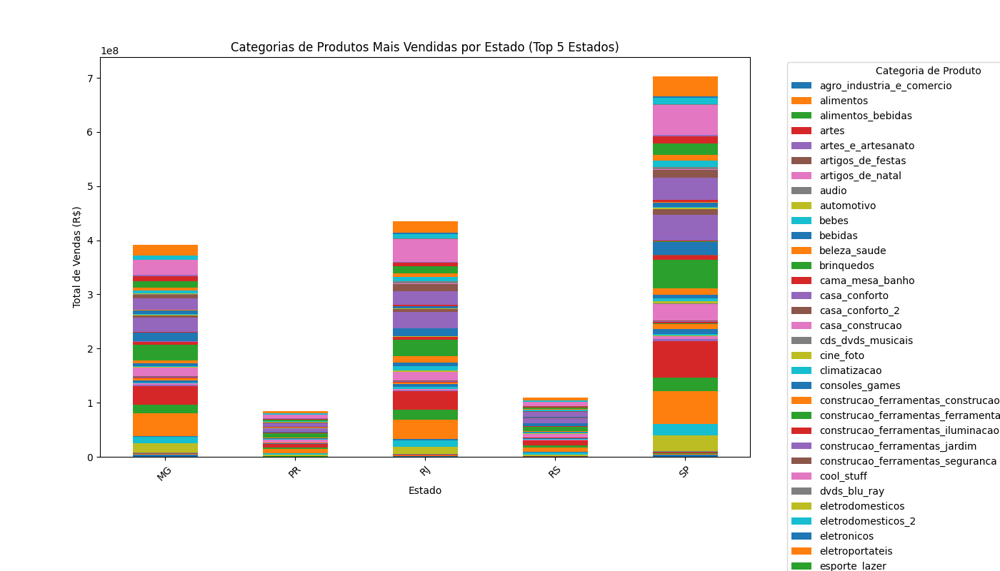
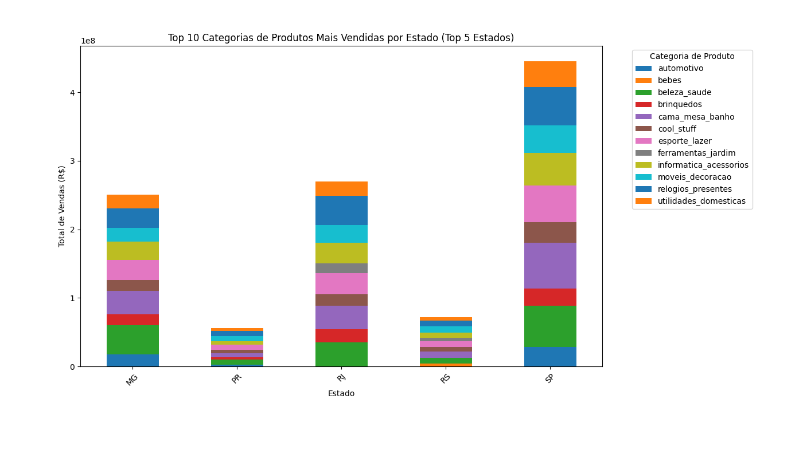

# Análise de Clientes e Vendas por Estado no Brasil

Este projeto realiza uma análise exploratória da base de dados de clientes e vendas por estado no Brasil. O objetivo é compreender a distribuição de clientes e vendas, identificar os estados com maior participação e visualizar as categorias de produtos mais vendidas.

## Objetivo

O objetivo deste projeto é analisar o comportamento de clientes e vendas em diferentes estados do Brasil, bem como entender quais categorias de produtos têm maior destaque em termos de vendas.

## Estrutura dos Arquivos

- `notebook_analise.ipynb`: Notebook Jupyter contendo o código da análise e visualizações.
- `grafico_17.png`: Gráfico de barras mostrando o número de clientes por estado.
- `grafico_19.png`: Gráfico de barras mostrando o total de vendas por estado (R$).
- `grafico_24.png`: Gráfico empilhado das categorias de produtos mais vendidas por estado (Top 5 estados).
- `grafico_25.png`: Gráfico empilhado das 10 principais categorias de produtos mais vendidas por estado (Top 5 estados).

## Visualizações

### 1. Número de Clientes por Estado

Este gráfico mostra a quantidade de clientes distribuída por estado no Brasil. São Paulo lidera com mais de 5 milhões de clientes, seguido pelo Rio de Janeiro e Minas Gerais.

### 2. Total de Vendas por Estado

O gráfico exibe o total de vendas em R$ por estado. São Paulo e Rio de Janeiro dominam em termos de volume de vendas, com São Paulo superando a marca de R$ 700 milhões.

### 3. Categorias de Produtos Mais Vendidas por Estado (Top 5 Estados)

Este gráfico empilhado mostra as diferentes categorias de produtos vendidos nos cinco estados com maior volume de vendas (MG, RJ, PR, RS, SP). Cada cor representa uma categoria de produto diferente, permitindo comparar a variedade e o volume de vendas em cada estado.

### 4. Top 10 Categorias de Produtos Mais Vendidas por Estado (Top 5 Estados)

Este gráfico exibe as 10 categorias de produtos mais vendidas nos cinco estados com maior volume de vendas. As principais categorias incluem **automotivo**, **bebês**, **beleza e saúde**, e **utilidades domésticas**, com destaque especial para São Paulo e Minas Gerais.

## Conclusões

- **São Paulo** e **Rio de Janeiro** são os estados com maior número de clientes e volume de vendas, representando uma parcela significativa das receitas.
- Há uma diversidade considerável de categorias de produtos, com destaque para itens automotivos, produtos para bebês, e utilidades domésticas nos estados analisados.
- Estados como **Minas Gerais**, **Paraná** e **Rio Grande do Sul** também possuem participação relevante em categorias específicas, o que demonstra a diversidade regional nas preferências de compra.

## Ferramentas Utilizadas

- **Linguagem de Programação**: Python
- **Bibliotecas**: Pandas, Matplotlib
- **Ambiente**: Jupyter Notebook
- **Visualizações**: Gráficos de barras e gráficos empilhados

